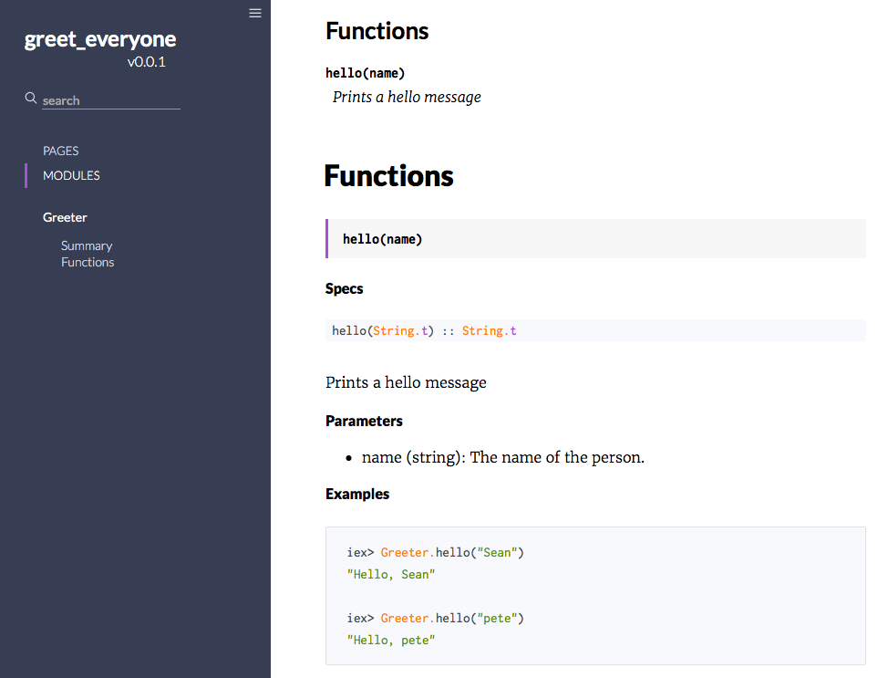

# 文档
elixir 代码文档化.

<!-- TOC -->

- [文档](#%E6%96%87%E6%A1%A3)
    - [注释](#%E6%B3%A8%E9%87%8A)
        - [行内文档](#%E8%A1%8C%E5%86%85%E6%96%87%E6%A1%A3)
        - [文档化模块](#%E6%96%87%E6%A1%A3%E5%8C%96%E6%A8%A1%E5%9D%97)
        - [文档化函数](#%E6%96%87%E6%A1%A3%E5%8C%96%E5%87%BD%E6%95%B0)
    - [ExDoc](#exdoc)
        - [安装](#%E5%AE%89%E8%A3%85)
        - [生成文档](#%E7%94%9F%E6%88%90%E6%96%87%E6%A1%A3)
    - [最佳实践](#%E6%9C%80%E4%BD%B3%E5%AE%9E%E8%B7%B5)

<!-- /TOC -->

## 注释
代码的注释量, 文档的质量, 在编程的世界中依然是个有争论的问题. 但是, 我们都认同文档对我们自己以及使用我们代码的人都是很重要的.

elixir 将文档视作 _一等公民_, 为我们的项目提供了大量的功能来访问和生成文档. elixir 核心为我们提供了许多不同的属性来标注代码. 让我们看看这3种方式:
* `#` - 行内注释
* `@moduledoc` - 模块注释
* `@doc` - 函数注释

### 行内文档
行内注释可能是为代码添加注释最简单的方法了. 类似 Ruby 和 Python, elixir 的行内注释使用 `#` 标记. 也就是井号.

观察这个 elixir 脚本 (greeting.exs):
```elixir
# Outputs 'Hello, chum.' to the console.
IO.puts("Hello, " <> "chum.")
```

当 elixir 执行脚本时, 会忽略掉 `#` 后这行的所有代码, 将其视为无用的数据. 添加注释对代码的操作和性能不会产生影响, 但是, 别的程序员并不明确了解代码实现了些什么的情况下, 可以通过阅读你的注释来了解它. 注意不要滥用行内注释! 凌乱的代码会不受欢迎. 请适度使用.

### 文档化模块
`@moduledoc` 注释器允许添加模块级别的内联文档. 它通常位于文件顶部的 `defmodule` 声明之后. 下面的例子显示了在 `@moduledoc` 装饰器中的一行注释:
```elixir
defmodule Greeter do
  @moduledoc """
  Provides a function `hello/1` to greet a human
  """

  def hello(name) do
    "Hello, " <> name
  end
end
```

我们可以在 iex 中通过帮助函数 `h` 来获取模块的文档.
```elixir
iex> c("greeter.ex")
[Greeter]

iex> h Greeter

                Greeter

Provides a function hello/1 to greet a human
```

### 文档化函数
就像 elixir 提供给我们添加模块级注释一样, 同样具有类似的功能用来注释函数. `@doc` 注释器允许添加函数级别的内联文档. `@doc` 注释器位于被注释的函数之上.
```elixir
defmodule Greeter do
  @moduledoc """
  ...
  """

  @doc """
  Prints a hello message

  ## Parameters

    - name: String that represents the name of the person.

  ## Examples

      iex> Greeter.hello("Sean")
      "Hello, Sean"

      iex> Greeter.hello("pete")
      "Hello, pete"

  """
  @spec hello(String.t()) :: String.t()
  def hello(name) do
    "Hello, " <> name
  end
end
```

再次回到 iex 中, 当我们在模块名前的函数上使用帮助命令(`h`), 我们可以看到:
```elixir
iex> c("greeter.ex")
[Greeter]

iex> h Greeter.hello

                def hello(name)

Prints a hello message

Parameters

  • name: String that represents the name of the person.

Examples

    iex> Greeter.hello("Sean")
    "Hello, Sean"

    iex> Greeter.hello("pete")
    "Hello, pete"

iex>
```
你是否注意到我们可以在文档中使用标记语言, 并且在命令行中渲染出来? 除了很酷以外, 这还是 elixir 生态系统中一个新的补充, 当你看到通过 ExDoc 动态生成 HTML 格式文档的时候, 你会觉得更有趣.

**注意**: `@spec` 注释是用来进行代码静态分析的. 要学习更多信息, 请查看[规范和类型](https://elixirschool.com/en/lessons/advanced/typespec)章节.

## ExDoc
ExDoc 是一个官方的项目, 你可以在[GitHub](https://github.com/elixir-lang/ex_doc)中看到. 其可以为 elixir 项目生成 **HTML 和在线文档**. 首先, 让为我们的应用创建一个 Mix 项目.
```shell
$ mix new greet_everyone

* creating README.md
* creating .gitignore
* creating mix.exs
* creating config
* creating config/config.exs
* creating lib
* creating lib/greet_everyone.ex
* creating test
* creating test/test_helper.exs
* creating test/greet_everyone_test.exs

Your Mix project was created successfully.
You can use "mix" to compile it, test it, and more:

    cd greet_everyone
    mix test

Run "mix help" for more commands.

$ cd greet_everyone
```

现在复制粘贴 `@doc` 注释器章节部分的代码到 `lib/greeter.ex` 这个文件中, 并且通过命令行验证其可以正常的工作. 现在我们使用 `iex -S mix` 来确保我们在命令行中可以和 Mix 项目交互:
```elixir
iex> h Greeter.hello

                def hello(name)

Prints a hello message

Parameters

  • name: String that represents the name of the person.

Examples

    iex> Greeter.hello("Sean")
    "Hello, Sean"

    iex> Greeter.hello("pete")
    "Hello, pete"
```

### 安装
假设一切正常, 我们会看到类似上面的输出, 现在可以准备安装 ExDoc. 在 `mix.exs` 文件中, 添加俩个必须的依赖: `:earmark` 和 `:ex_doc`.
```elixir
def deps do
    [{:earmark, "~> 0.1", only: :dev},
    {:ex_doc, "~> 0.11", only: :dev}]
  end
```
我们指定 `only: :dev` 键值对, 表明我们不希望在生成环境中下载并编译这些依赖. Earmark 是 elixir 编程语言的 markdown 解析器, ExDoc 利用它将 `@moduledoc` 和 `@doc` 中的文档转换为美观的 HTML.

需要注意的是, 并不是强制使用 Earmark 的. 你可以使用别的标记解析器, 例如 `Pandoc`, `Hoedown` 或者 `Cmark`; 但是, 你可能需要修改一些配置, 相关资讯可以在[这里](https://github.com/elixir-lang/ex_doc#changing-the-markdown-tool)获取. 在这个教程中, 我们使用 Earmark.

### 生成文档
我们继续, 在命令行中执行以下两条指令:
```shell
$ mix deps.get # gets ExDoc + Earmark.
$ mix docs # makes the documentation.

Docs successfully generated.
View them at "doc/index.html".
```

若一切正常, 你会看到类似上面所示的信息. 在我们的 Mix 项目中, 我们可以看到一个名为 `doc/` 的文件夹, 里面包含我们刚刚生成的文档. 当我们在浏览器中打开 `index` 页面时, 可以看到:


我们可以看到 Earmark 渲染了我们的文档, 并由 ExDoc 用友好的格式显示出来.


我们现在可以将其部署至 GitHub, 我们自己的网站, 或者更常用的 HexDocs.

## 最佳实践
应在语言的最佳实践指南的指导下添加文档. 由于 elixir 是一门年轻的语言, 随着生态发展, 很多标准还在制定中. 社区也再努力尝试建立最佳实践. 要了解最佳实践的详细内容, 请参考 [elixir 风格指南](https://github.com/christopheradams/elixir_style_guide).

* 始终保持编写模块文档
    ```elixir
    defmodule Greeter do
      @moduledoc """
      This is good documentation.
      """
    
    end
    ```
* 如果不打算为模块编写文档, **不要**留空, 考虑将 `@moduledoc` 注释为 `fasle`:
    ```elixir
    defmodule Greeter do
      @moduledoc false

    end
    ```
* 当在模块文档中引用函数时, 用 ``/` 包围:
    ```elixir
    defmodule Greeter do
      @moduledoc """
      ...

      This module also has a `hello/1` function.
      """

      def hello(name) do
        IO.puts("Hello, " <> name)
      end
    end
    ```
* `@moduledoc` 下的文档, 一行只写一句:
    ```elixir
    defmodule Greeter do
      @moduledoc """
      ...

      This module also has a `hello/1` function.
      """

      alias Goodbye.bye_bye
      # and so on...

      def hello(name) do
        IO.puts("Hello, " <> name)
      end
    end
    ```
* 使用 Markdown 编写文档, 无论在 IEx 或者 ExDoc 中都会更易阅读.
    ```elixir
    defmodule Greeter do
      @moduledoc """
      ...
      """

      @doc """
      Prints a hello message

      ## Parameters

        - name: String that represents the name of the person.

      ## Examples

          iex> Greeter.hello("Sean")
          "Hello, Sean"

          iex> Greeter.hello("pete")
          "Hello, pete"

      """
      @spec hello(String.t()) :: String.t()
      def hello(name) do
        "Hello, " <> name
      end
    end
    ```
* 在文档中试着包含代码用例. 使用 [ExUnit.DocTest](https://hexdocs.pm/ex_unit/ExUnit.DocTest.html) 从模块, 函数或者宏中的代码示例自动生成测试. 为了实现这一点, 你需要在测试用例中调用宏 `doctest/1`, 并遵循[官方文档](https://hexdocs.pm/ex_unit/ExUnit.DocTest.html)的一些准则编写测试用例.
